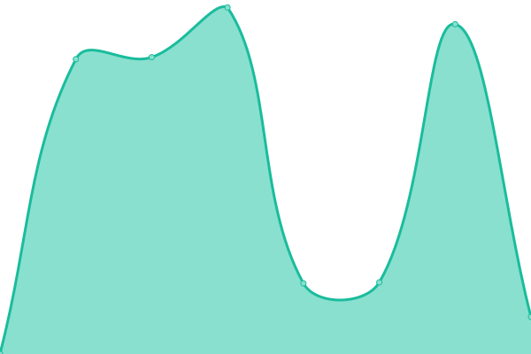
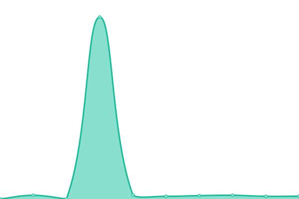

# [📈 Live Status](https://demo.upptime.js.org): <!--live status--> **🟧 Partial outage**

This repository contains the open-source uptime monitor and status page for [Artyom Gorin](https://demo.upptime.js.org), powered by [Upptime](https://github.com/upptime/upptime).

With [Upptime](https://upptime.js.org), you can get your own unlimited and free uptime monitor and status page, powered entirely by a GitHub repository. We use [Issues](https://github.com/mysubcult/uptime/issues) as incident reports, [Actions](https://github.com/mysubcult/uptime/actions) as uptime monitors, and [Pages](https://demo.upptime.js.org) for the status page.

<!--start: status pages-->
<!-- This summary is generated by Upptime (https://github.com/upptime/upptime) -->
<!-- Do not edit this manually, your changes will be overwritten -->
<!-- prettier-ignore -->
| URL | Status | History | Response Time | Uptime |
| --- | ------ | ------- | ------------- | ------ |
|  [Bot](https://telegram-feedback-bot-topics.onrender.com/healthz) | 🟩 Up | [bot.yml](https://github.com/mysubcult/uptime/commits/HEAD/history/bot.yml) | 

 296ms
     
 | 

<a href="https://mysubcult.github.io/uptime/history/bot">100.00%</a>
    

|  [Bot-3](https://api.telegram.org/bot6300110269:AAEIYn2rDe7EIjrtECXlc7BsJy-GSj9gIAc/sendMessage?chat_id=389669884&text=hi) | 🟥 Down | [bot-3.yml](https://github.com/mysubcult/uptime/commits/HEAD/history/bot-3.yml) | 

 420ms
     
 | 

<a href="https://mysubcult.github.io/uptime/history/bot-3">0.00%</a>
    

|  [SmartDiag feedback on render](https://telegram-feedback-bot-topics.onrender.com/healthz) | 🟩 Up | [smart-diag-feedback-on-render.yml](https://github.com/mysubcult/uptime/commits/HEAD/history/smart-diag-feedback-on-render.yml) | 

 237ms
     
 | 

<a href="https://mysubcult.github.io/uptime/history/smart-diag-feedback-on-render">100.00%</a>
    

<!--end: status pages-->

[**Visit our status website →**](https://demo.upptime.js.org)

## 📄 License

- Powered by: [Upptime](https://github.com/upptime/upptime)
- Code: [MIT](./LICENSE) © [Artyom Gorin](https://demo.upptime.js.org)
- Data in the `./history` directory: [Open Database License](https://opendatacommons.org/licenses/odbl/1-0/)
